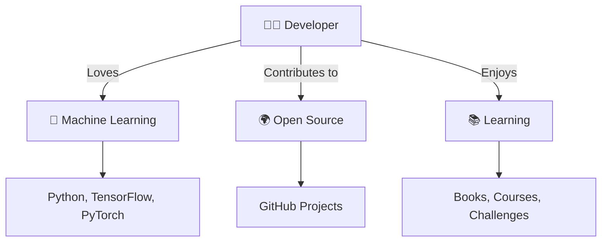

# Hi there, I'm Sushant Dagar 👋

---

  

## 🚀 About Me

- 🔭 I’m currently working on: **AI/ML projects**
- 🌱 I’m learning: **Advanced Deep Learning, MLOps**
- 👯 I’m looking to collaborate on: **Open Source ML tools**
- 💬 Ask me about: **Python, Data Science, ML**
- 📫 How to reach me: [email2sushantdagar@gmail.com](mailto:email2sushantdagar@gmail.com)
- ⚡ Fun fact: I love visualizing data in creative ways!

---

## 📈 GitHub Stats

  
  
  

---

## 🗺️ Contribution Graph

  

---

## 🏄‍♂️ Unique Profile Summary

  

  
✨ Click to see my journey (Animated SVG)

  

    
  

---

## 🛠️ Tech Stack

---

## 📫 Connect with Me

---

  

<!-- Replace YOUR_GITHUB_USERNAME, YOUR_LINKEDIN, YOUR_TWITTER, and your.email@example.com with your actual details -->
